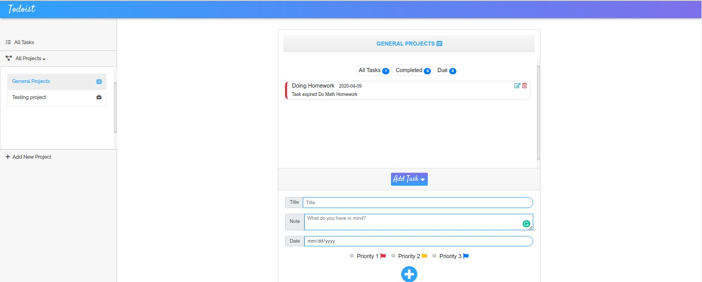

# js-todo-app
A to-do list app built with JavaScript

## Table of Contents

* [About the Project](#about-the-project)
  * [Built With](#built-with)
* [Authors](#authors)
* [Show your Support](#show-your-support)
* [Acknowledgements](#acknowledgements)

<!-- ABOUT THE PROJECT -->
## About The Project

In this project, we create a Todo List app using Javascript. The users can create a project, and assign to it their tasks. The tasks can include title, description, date, and priority. 

We are using the knowledge acquired about: Objects, Factory Function, and  Module Patterns. Also, we implement the concepts of Single Responsibility and Tightly Coupled Objects.

Live version of the project: [Live version](https://raw.githack.com/adaorachi/js-todo-app/todo-app/index.html)

Project Link: [JS-TODO-APP](https://github.com/adaorachi/js-todo-app)

Link for project specifications: [Odin-Project](https://www.theodinproject.com/courses/javascript/lessons/todo-list)

### Built With

*   HTML5
*   SCSS
*   Bootstrap
*   Javascript
*   Webpack

<!-- CONTACT -->
## Authors

 **Author1**

 MaryAnn Chukwuka
 - Github: [@adaorachi](https://github.com/adaorachi)
 - Linkedin: [MaryAnn Chukwuka](https://www.linkedin.com/in/adaorachi/) 
 
**Author2**

  Melissa Castorena 
- Github: [@mcastorena0316](https://github.com/mcastorena0316)
- Linkedin: [Melissa Castorena](https://www.linkedin.com/in/melissa-castorena

<!-- ABOUT THE PROJECT-->
## Show your support

Give a star if you like this project!

<!-- ACKNOWLEDGEMENTS -->
## Acknowledgements

* [Microverse](https://www.microverse.org/)